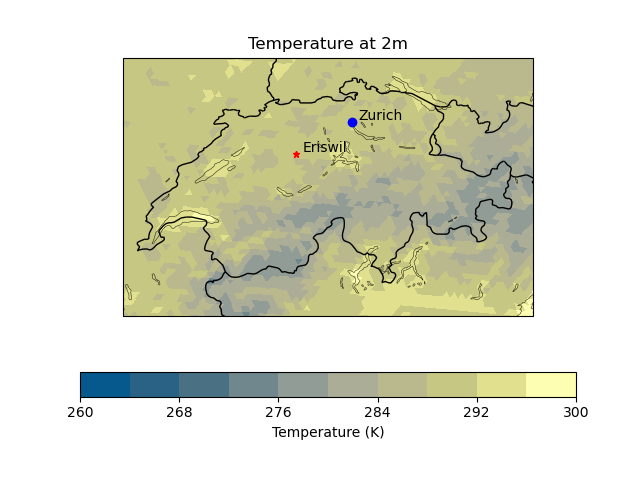
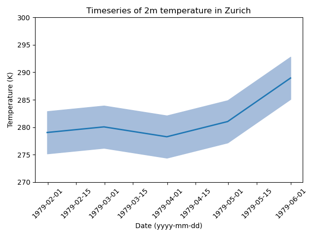

# icon-vis
Collection of python scripts to visualise ICON-simulations on the unstructered grid. The different folders contain example code for different kind of plots. Example plots for each folder can be found below. More detailed descriptions for each plot are in the README files of the different folders. The routines are mainly based on the python library  [psyplot](https://psyplot.github.io).
For visualizing data along a transect, [psy-transect](https://github.com/psyplot/psy-transect) is currently under development. 

# Getting started with psyplot
Export path to conda (if using daint or euler: install miniconda on scratch to avoid memory issues)

    export PATH="~/miniconda3/bin:$PATH"

Create a conda environement with python[version>=3.7,<3.10] (psy-view requirement):

    conda create -n psyplot python=3.9.7

Activate environment (use "source activate" in case "conda activate" does not work):

    conda activate psyplot

Install requirements:

    conda install -c conda-forge --file ~/icon-vis/psyplot/requirements.txt

You can install psy-transect with (not officially released yet):

    python -m pip install --user -U git+https://github.com/psyplot/psy-transect

# Example plots
**mapplot:**

**timeseries:**

**height_profile:**

# General remark
Whenever using psyplot for a publication it should be cited https://psyplot.github.io/psyplot/#how-to-cite-psyplot.
Feel free to add your own routines or adding features to already existing ones.

# Trouble shooting
1. The psyplot library needs the boundary variables (clon_bnds, clat_bnds). If they are not in the nc file, the information can be added with a grid file.

2. *ValueError: numpy.ndarray size changed, may indicate binary incompatibility.*

Can be solved by reinstalling numpy:

    pip uninstall numpy

    pip install numpy

3. *ValueError: Can only plot 2-dimensional data!*

Your input file is missing grid information. Add the path to a grid file in the config under the section 'var' with the option 'grid_file'.

4. *ValueError: arguments without labels along dimension 'cell' cannot be aligned because they have different dimension sizes.*

Opposite of 2. You need to remove the 'add_grid' option from the section 'var'.
